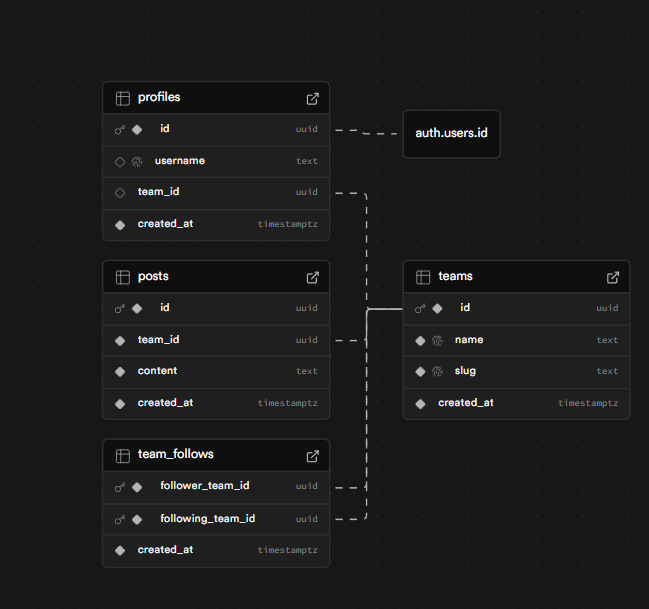

# V.SOCIAL — Team-Based Social Media MVP

A team-based social media platform built with **Next.js 15 (App Router)** and **Supabase**. Teams are the first-class identity — there are no individual user profiles. All posts, follows, and social actions are performed under a team identity.

Live on: https://case-vizioapp.vercel.app/

---

## Setup Instructions

### Prerequisites

- Node.js 18+
- A [Supabase](https://supabase.com) project

### 1. Clone & Install

```bash
git clone <repo-url>
cd vizioapp
npm install
```

### 2. Environment Variables

Create a `.env.local` file in the project root:

```env
NEXT_PUBLIC_SUPABASE_URL=your_supabase_project_url
NEXT_PUBLIC_SUPABASE_ANON_KEY=your_supabase_anon_key
NEXT_PUBLIC_SITE_URL=http://localhost:3000
```

### 3. Database Setup

In your Supabase project, open the **SQL Editor** and run the full contents of `db-schema.sql`. This will create all tables, RLS policies, helper functions, and triggers.

> **Important:** If you are re-running the schema (e.g. after a reset), drop existing tables first to avoid conflicts.

### 4. Google OAuth (Optional)

In your Supabase dashboard:

- Go to **Authentication → Providers → Google**
- Enable Google OAuth and add your credentials
- Add `http://localhost:3000/auth/callback` as an allowed redirect URL

### 5. Run

```bash
npm run dev
```

Open [http://localhost:3000](http://localhost:3000).

---

## User Flow

```
Sign up / Log in
      ↓
/onboarding  →  Set username + Create or Join a team
      ↓
/feed        →  View global feed, create posts, follow teams
      ↓
/teams/[slug] →  Team profile: stats, members, posts, follow button
```

---

## Supabase Schema

### Tables

| Table          | Purpose                                                                                         |
| -------------- | ----------------------------------------------------------------------------------------------- |
| `teams`        | Core team entity — name, slug                                                                   |
| `profiles`     | Links `auth.users` to a team. Holds `username`. One user → one team (N users can share a team). |
| `posts`        | Team-owned text posts (1–500 chars)                                                             |
| `team_follows` | Directional follow relationship between teams                                                   |



### Key Design Decisions

**`profiles.team_id` is nullable until onboarding is complete.**
Users are created in `auth.users` on signup. A bare profile row (no username, no team) is inserted by a DB trigger. The user is then routed to `/onboarding` where they pick a username and either create or join a team. This allows the same flow to work for both email/password and Google OAuth signups.

**N:1 user-to-team relationship.**
Multiple users can belong to the same team. This is the core product model — the team is the identity, not the individual. All members share the same permissions (no roles in scope for this MVP).

**Posts have no `author_user_id`.**
This is intentional. Posts belong to the team, not to the individual who created them. This enforces the team identity concept at the data layer.

### RLS Summary

All tables have Row Level Security enabled.

| Table          | Read                                                 | Write                                                    |
| -------------- | ---------------------------------------------------- | -------------------------------------------------------- |
| `teams`        | Public                                               | Authenticated users (to create a team during onboarding) |
| `profiles`     | Public (username + team_id visible for member lists) | Own row only                                             |
| `posts`        | Public                                               | Insert/delete only if `team_id = my_team_id()`           |
| `team_follows` | Public                                               | Insert/delete only if `follower_team_id = my_team_id()`  |

**`my_team_id()` helper function:**
A `SECURITY DEFINER` SQL function that resolves the current user's `team_id` from their profile via `auth.uid()`. Used across RLS policies to avoid repeating the same subquery logic and to enable stable caching by PostgreSQL.

---

## Key Assumptions & Trade-offs

### Onboarding page instead of inline signup flow

The PDF suggests creating a team during signup. I chose to separate this into a dedicated `/onboarding` page. This keeps the auth flow clean (signup = create account only) and works identically for email/password and Google OAuth without special-casing either path.

### Middleware performs a DB query on every request

To detect whether a logged-in user has completed onboarding, the middleware queries `profiles` on every non-auth page request. This is acceptable for an MVP but would not scale well. In production, this would be replaced with a **JWT custom claim** (`onboarding_complete: true`) injected at login time via a Supabase Auth Hook, eliminating the per-request DB round-trip entirely.

### No `author_user_id` on posts

Posts are attributed to a team, not a user. This is a deliberate product decision aligned with the spec. The trade-off is that there is no audit trail of which team member created a post. If needed, adding `author_user_id uuid REFERENCES auth.users` to `posts` would be straightforward without breaking existing data or RLS logic.

### Follow system is team-to-team, not user-to-team

A user's follow actions affect their entire team. If user A and user B are on the same team, they share the same follow list. This is consistent with the team-as-identity model but means individual members cannot have independent social graphs.

### No RLS test coverage

The RLS policies are manually verified but not unit tested. In a production environment, [pgTAP](https://pgtap.org/) would be used to write automated tests asserting, for example, that a user cannot delete another team's post even with a direct SQL call.

### Search uses `ILIKE`, not full-text search

Team search on the onboarding page uses `ILIKE '%query%'`. This is simple and correct for small datasets. At scale, enabling the `pg_trgm` PostgreSQL extension would provide fuzzy matching and significantly better search performance via GIN indexes.

---

## What I Would Improve With More Time

1. **JWT custom claims for onboarding state** — Remove the per-request DB query in middleware. Inject `onboarding_complete` into the JWT at login via a Supabase Auth Hook.

2. **pgTAP RLS tests** — Write automated tests for every RLS policy to catch regressions when schema changes.

3. **Optimistic UI updates** — The follow button currently waits for the server action to resolve before updating. With `useOptimistic`, the UI can update instantly and roll back on error.

4. **Pagination on the feed** — Currently limited to 50 posts with `.limit(50)`. Cursor-based pagination (using `created_at` as cursor) would be the right approach at scale.

5. **Team invitation system** — Right now any user can join any team by searching for it. A proper invitation flow (invite link or email-based) would be more secure and realistic.

6. **Rate limiting on post creation** — No rate limiting exists. A Supabase Edge Function or middleware-level check could enforce a per-team post rate limit.

7. **ERD and architecture diagram in README** — A visual schema diagram would make the data model easier to communicate during code review.

---

## Project Structure

```
app/
├── (auth)/          # Login, signup pages
├── (app)/           # Authenticated pages
│   ├── feed/        # Global feed
│   ├── onboarding/  # Username + team setup
│   └── teams/[slug] # Team profile page
├── actions/         # Server actions (auth, posts, follows, onboarding)
└── auth/callback/   # OAuth callback handler

components/
└── features/        # PostCard, PostForm, FollowButton, TeamCard, UnfollowButton

lib/
└── supabase/        # Browser + server Supabase clients

types/
└── database.ts      # Type definitions matching Supabase schema
```
